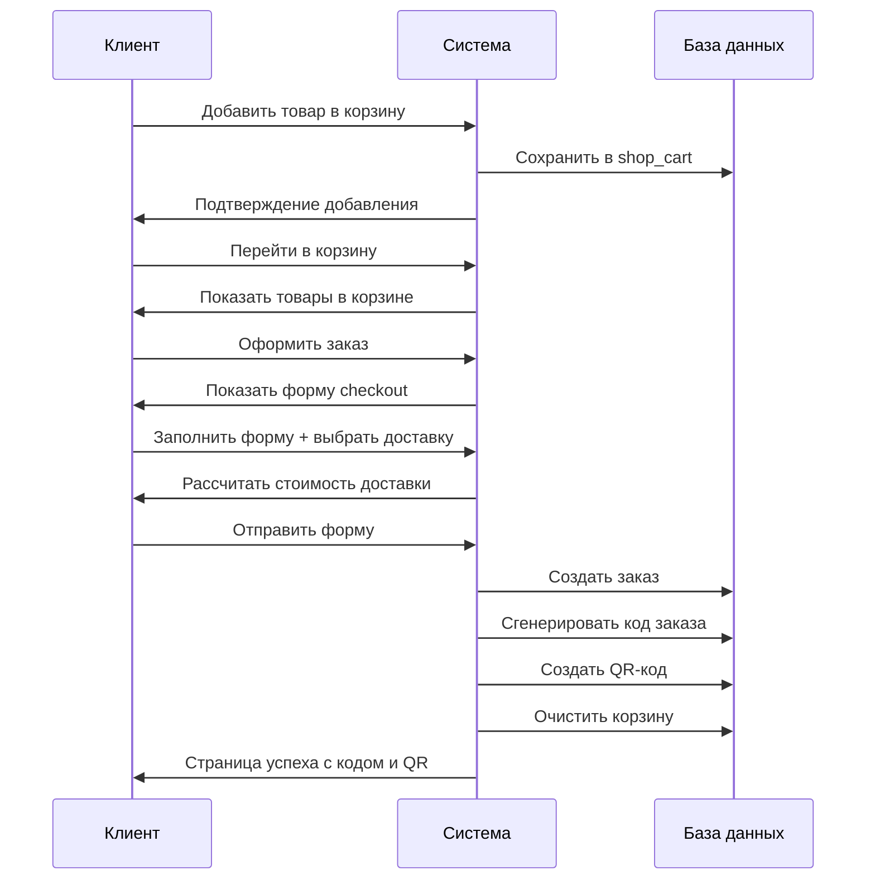
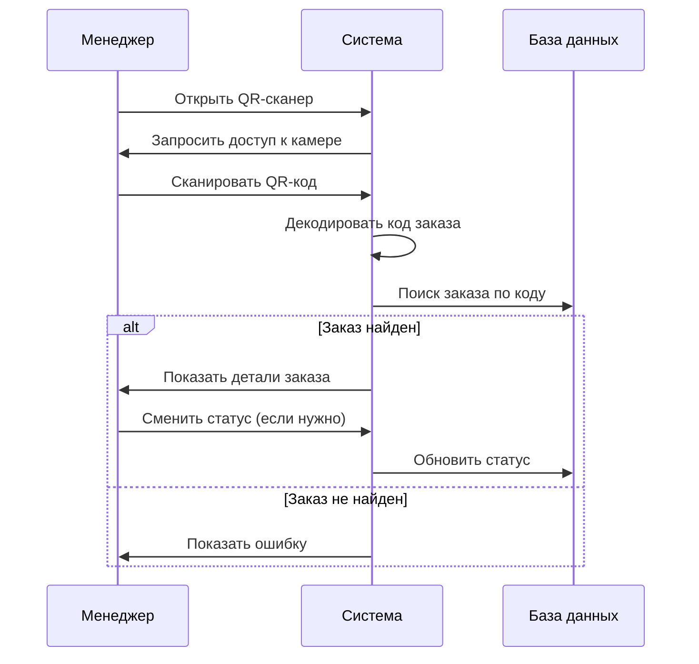
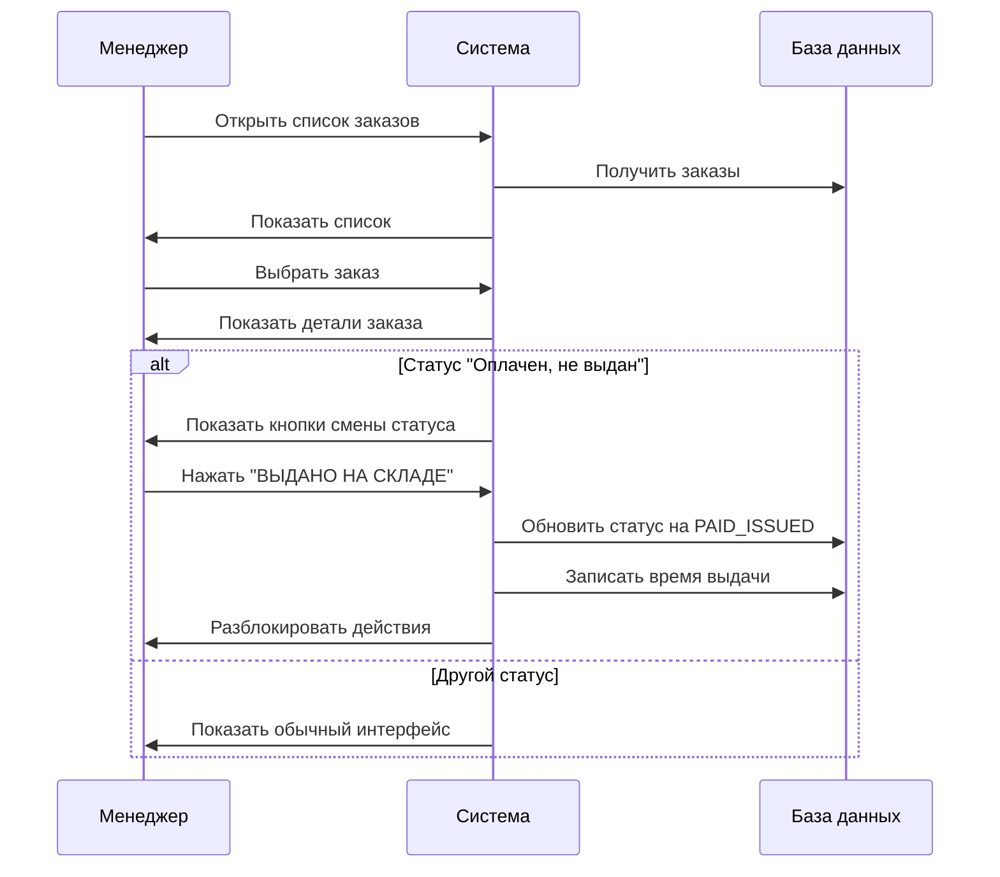
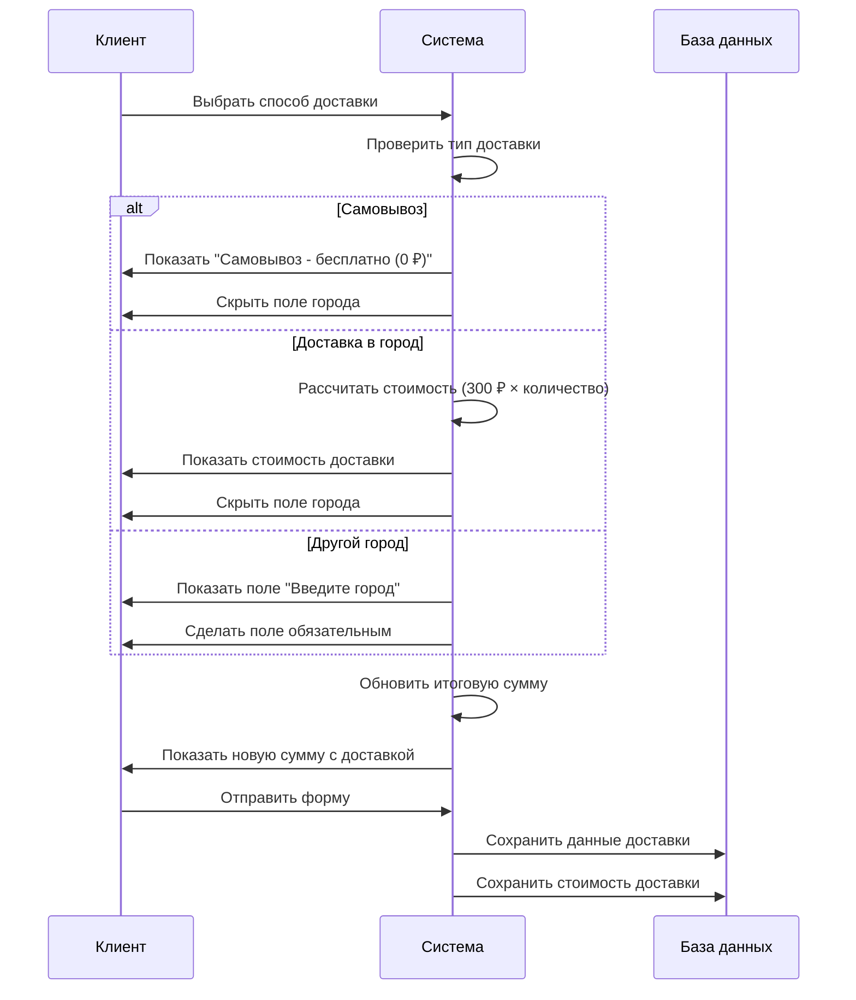
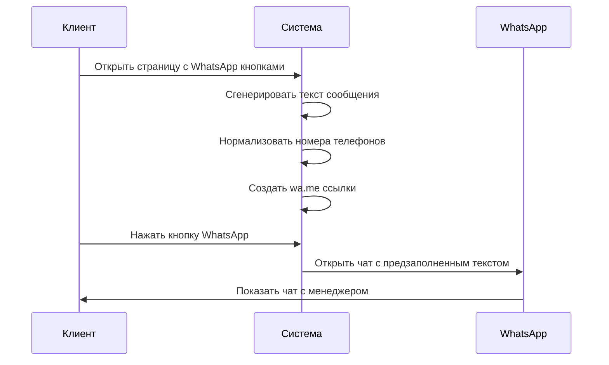

# 🔄 Ключевые бизнес-процессы - Sirius Group

## TL;DR
- **Создание заказа**: корзина → данные → доставка → оплата → QR-код
- **Проверка заказа**: QR-скан или код + телефон → детали заказа
- **Работа менеджера**: смена статуса заказа на "выдан/не выдан"
- **Система доставки**: выбор варианта → расчет стоимости → оформление
- **WhatsApp интеграция**: автоматическая связь с менеджерами

---

## 🛒 Процесс 1: Создание заказа клиентом

### **Описание процесса:**
Клиент добавляет товары в корзину, оформляет заказ с выбором доставки, получает уникальный код и QR-код для отслеживания.

### **Пошаговый сценарий:**

1. **Просмотр каталога** (`/shop/`)
   - Клиент выбирает товары
   - Добавляет в корзину через кнопку "Добавить в корзину"

2. **Корзина** (`/shop/cart`)
   - Просмотр добавленных товаров
   - Изменение количества через кнопки "+" и "-"
   - Удаление товаров через красный крестик "✕"
   - Переход к оформлению через кнопку "Оформить заказ"

3. **Оформление заказа** (`/shop/checkout`)
   - Заполнение формы:
     - Имя (обязательно)
     - Телефон (обязательно, маска +7)
     - Способ доставки (обязательно)
     - Город для доставки (если выбран "Другой город")
     - Способ оплаты (обязательно)
   - Динамический расчет стоимости доставки
   - Кнопка "Оформить заказ"

4. **Обработка заказа**
   - Валидация данных
   - Создание записи в БД
   - Генерация уникального кода заказа
   - Создание QR-кода
   - Очистка корзины
   - Редирект на страницу успеха

5. **Страница успеха** (`/shop/order-success`)
   - Отображение кода заказа
   - QR-код для сканирования
   - WhatsApp контакты менеджеров
   - Кнопка "Оплатить доставку"

### **Mermaid диаграмма последовательности:**

---

## 🔍 Процесс 2: Проверка заказа

### **Описание процесса:**
Клиент или менеджер проверяет статус заказа через QR-скан или ввод кода + телефона.

### **Пошаговый сценарий:**

1. **QR-сканер** (`/qr-scanner`)
   - Менеджер открывает QR-сканер
   - Система запрашивает доступ к камере
   - Сканирование QR-кода заказа
   - Автоматический переход к деталям заказа

2. **Поиск по коду** (`/orders/search`)
   - Ввод кода заказа (8 символов)
   - Ввод телефона клиента
   - Поиск в базе данных
   - Отображение результатов

3. **Детали заказа** (`/orders/{code}`)
   - Полная информация о заказе
   - Статус заказа
   - Информация о доставке
   - Кнопки смены статуса (для менеджера)

### **Mermaid диаграмма последовательности:**

---

## 🏪 Процесс 3: Работа менеджера/склада

### **Описание процесса:**
Менеджер склада проверяет заказы, выдает товары клиентам и обновляет статусы заказов.

### **Пошаговый сценарий:**

1. **Список заказов** (`/orders`)
   - Просмотр всех заказов
   - Фильтрация по статусу, дате, менеджеру
   - Поиск по коду или телефону

2. **Детали заказа** (`/orders/{code}`)
   - Полная информация о заказе
   - Статус: "Оплачен, не выдан"
   - Блокировка действий до смены статуса

3. **Смена статуса**
   - Кнопка "✅ ВЫДАНО НА СКЛАДЕ"
   - Кнопка "❌ НЕ ВЫДАНО"
   - Запись времени смены статуса
   - Разблокировка действий

4. **Обновление БД**
   - Изменение статуса на `PAID_ISSUED` или `PAID_DENIED`
   - Запись времени в `issued_at`
   - Логирование операции

### **Mermaid диаграмма последовательности:**

---

## 🚚 Процесс 4: Система доставки

### **Описание процесса:**
Клиент выбирает способ доставки, система рассчитывает стоимость и интегрируется с WhatsApp для связи с менеджерами.

### **Пошаговый сценарий:**

1. **Выбор доставки** (в checkout)
   - 5 вариантов доставки:
     - Самовывоз (Грозный) - 0 ₽
     - Доставка в Грозный - 300 ₽ × количество
     - Доставка в Махачкалу - 300 ₽ × количество
     - Доставка в Хасавюрт - 300 ₽ × количество
     - Другой город - 300 ₽ × количество + ввод города

2. **Динамический расчет**
   - Показ/скрытие поля "Город"
   - Расчет стоимости доставки
   - Обновление итоговой суммы
   - Отображение информации о доставке

3. **Сохранение в БД**
   - Запись выбранного варианта доставки
   - Сохранение города (если введен)
   - Расчет и сохранение стоимости доставки
   - Обновление итоговой суммы заказа

4. **WhatsApp интеграция**
   - Кнопка "Оплатить доставку" → `/delivery/payment`
   - Автозаполнение текста сообщения
   - Ссылки на менеджеров:
     - Камалда: +7 999 398-01-59
     - Иван: +375 29 357-19-7

### **Mermaid диаграмма последовательности:**

---

## 📱 Процесс 5: WhatsApp интеграция

### **Описание процесса:**
Автоматическая интеграция с WhatsApp для связи клиентов с менеджерами по вопросам заказов и доставки.

### **Пошаговый сценарий:**

1. **Генерация сообщения**
   - Автоматическое формирование текста
   - Включение кода заказа
   - Информация о товаре и стоимости
   - Ссылки на детали заказа

2. **Нормализация номеров**
   - Камалда: +7 999 398-01-59
   - Иван: +375 29 357-19-7
   - Автоматическое форматирование

3. **Создание ссылок**
   - `https://wa.me/{номер}?text={сообщение}`
   - URL-кодирование сообщения
   - Открытие в новой вкладке

4. **Использование в UI**
   - Страница успешного заказа
   - Страница оплаты доставки
   - Кнопки с иконками WhatsApp

### **Mermaid диаграмма последовательности:**

---

## 🔍 Чек-лист готовности

- [x] Описан процесс создания заказа с полными деталями
- [x] Документирован процесс проверки заказа
- [x] Описана работа менеджера/склада
- [x] Документирована система доставки
- [x] Описана WhatsApp интеграция
- [x] Созданы Mermaid диаграммы для всех процессов
- [x] Показаны пошаговые сценарии
- [x] Описаны переходы между экранами

---

*Документ создан на основе статического анализа бизнес-логики*
